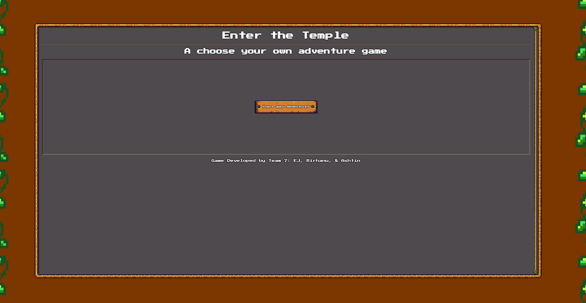
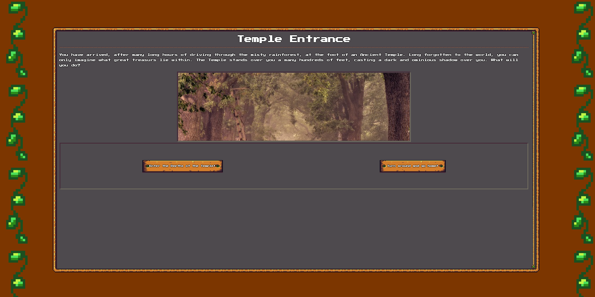
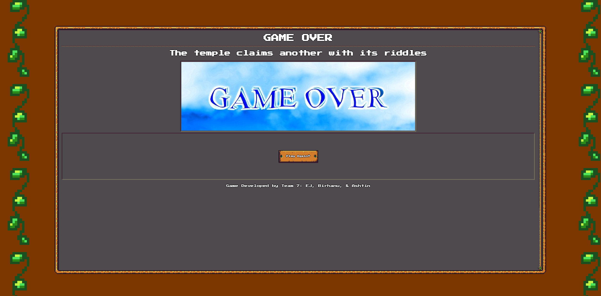

# ENTER THE TEMPLE

## PROJECT DESCRIPTION

Welcome to our game! The name of our game is called "Enter The Temple"! It's a game based on the adventure that the user picks their own path. Here the user will be able to choose multiple options and play the game according to how the user picks the adventure. The user can find his way to the end with using any path. The application was created with HTML, CSS and JavaScript. The CSS framework we used was from RPGUI. While using the framework from RPGUI we had multiple challanges including not being able to scroll. We fixed this issue by using an overflow property and flex boxes. We created a main gameplay template and rendered room objects into it. To render the room objects, we had to create connections from one object to the next. The connections we used were entry and option pathways. If the option from one object matched the entry of anoter object, then the page would render the entry object. We used click events to handle option selection. Some options brought you to a trap room that would display a riddle fetched from the riddle API. one of the challanges that we faced was selecting the right objects from a list using the click event. To solve this we stored all the objects into an array and iterated over the array. Once we found the correct match we saved the object into a room variable and passed that room variable into our render function. Another challange we faced was loading the end game screen with its proper explanation. Since the end game screen had multiple entry pathways each gameover scenario had to be unique. This challange was especially difficult due to the fact that the main gameplay screen and end game screen were separate HTML documents with their own script files. Our solution was to create an array of current and previous objects and store the array into local storage. By utilizing local storage, both script files were able to communicate with one another. Each member of our group was able to take on specific tasks created within our kanban board. Toward the end on our de-bugging phase, much of the code was altered through pair programming.

## Installation

N/A

## HOW TO USE

To play "Enter The Temple", the user can click on the start button, which will start the game. From there, select an option. You will have several choices in which rooms you want to enter into. Each room has an option that can either take the USER to a safe room in which the USER gets asked another question. An option can also lead to a trap room, which the USER gets asked a riddle. If you USER selects the correct answer, they can continue on their adventure and will be one step closer to victory!

## Credits

APIs Used:

pixabay API : https://pixabay.com/api

riddle API : https://riddles-api.vercel.app

rpgui : https://ronenness.github.io/RPGUI/

This game was a team effort and was built by TEAM 7!
Built and developed by: 
Edward-John (EJ) Muna : https://github.com/bear-muna 
Birhanu Mengistu : https://github.com/linotmike 
Ashtin (Ash) Betts : https://github.com/Solnatis

## License

Refer to repository for License.

## Links

Deployed Page: https://solnatis.github.io/Project-One/

## Screenshots

